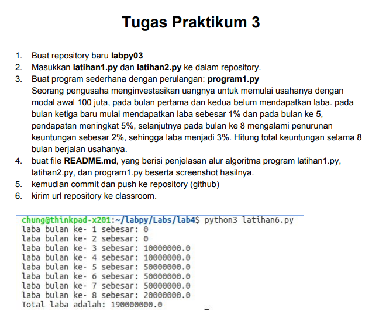
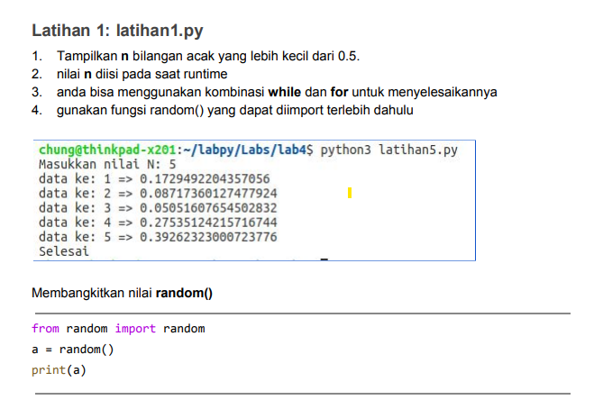
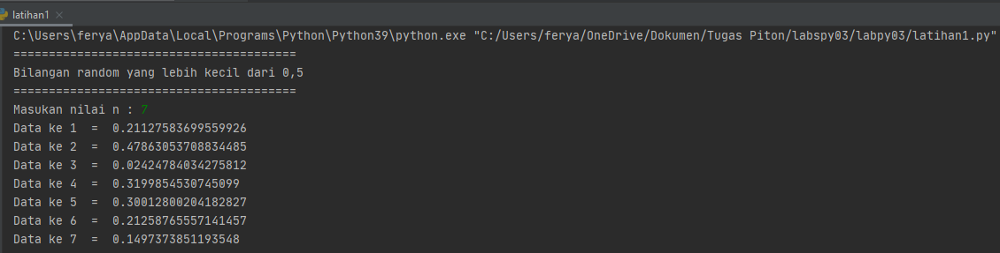

# labspy03

**Nama   : Fery Affandi** <br>
**NIM    : 312010018** <br>
**Kelas  : TI.20.A.1** <br>

-------------

## TUGAS PPT KE 3

Pada pertemuan 7 di PPT3 ini saya diberikan beberapa tugas diantaranya yaitu: <br>



## Latihan 1



untuk mengerjakannya kalian perlu memasukan sytax berikut

```python
import random
print(40*"=")
print("Bilangan random yang lebih kecil dari 0,5")
print(40*"=")
jum = int( input("Masukan nilai n : "))
i = 0
for i in range(jum):
    i += 1
    angkaDec = random.uniform(0, 0.5)
    print("Data ke", i, " = ", angkaDec)
```

Maka hasil yang didapat dari syntax tersebut adalah <br>



