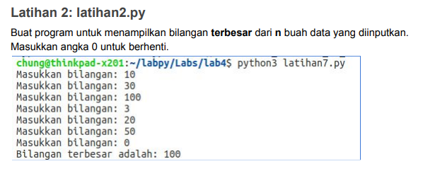
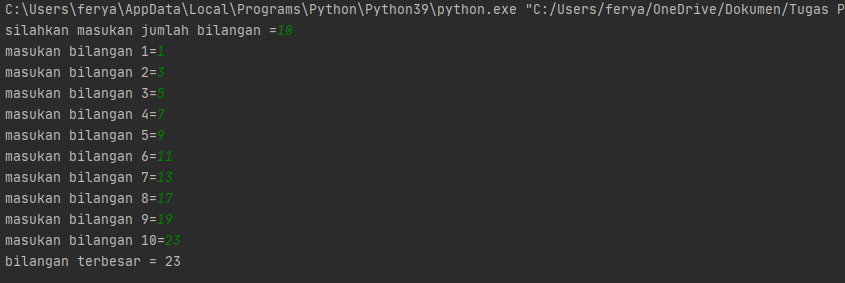

# labspy03

**Nama   : Fery Affandi** <br>
**NIM    : 312010018** <br>
**Kelas  : TI.20.A.1** <br>

-------------

## TUGAS PPT KE 3

Pada pertemuan 7 di PPT3 ini saya diberikan beberapa tugas diantaranya yaitu: <br>


## Latihan 1


untuk mengerjakannya kalian perlu memasukan sytax berikut

```python
import random
print(40*"=")
print("Bilangan random yang lebih kecil dari 0,5")
print(40*"=")
jum = int( input("Masukan nilai n : "))
i = 0
for i in range(jum):
    i += 1
    angkaDec = random.uniform(0, 0.5)
    print("Data ke", i, " = ", angkaDec)
```

Maka hasil yang didapat dari syntax tersebut adalah <br>


## Latihan 2



Untuk mengerjakan soal diatas maka kita perlu memasukan atau menginput datanya terlebih dahulu baru setelah itu bisa terlihat data mana yang terbesar denagn syntax.

```python
N=int(input("silahkan masukan jumlah bilangan ="))
if N>0:
    i=1
    x=int(input("masukan bilangan "+str(i)+"="))
    max=x;total=x
    for i in range(2,N+1):
        x=int (input("masukan bilangan "+str(i)+"="))
        total+=x
        if max<x:
            max=x

    print("bilangan terbesar =",max)
```

Setelah itu bisa langsung kalian "RUN" untuk dapat memasukan data yang sesuai dengan yang ada di soal seperti dibawah ini




